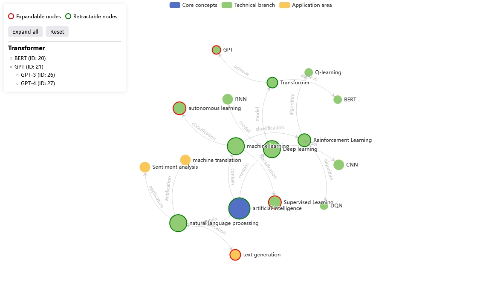
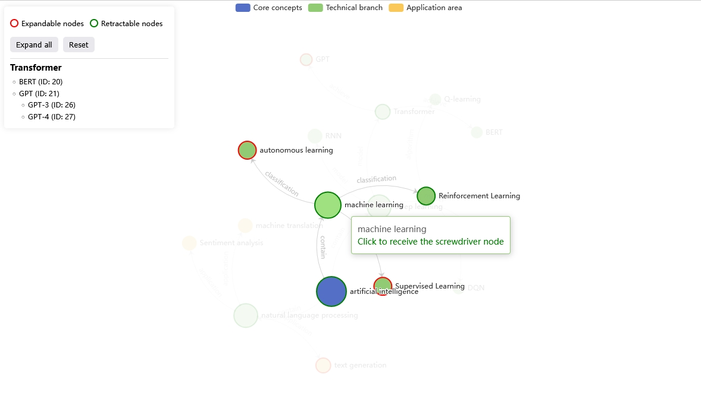

# 知识图谱可视化

[](README.md) [](README-zh.md)


------------


#### 主要框架及技术实现
* HTML
* Javascript
* [echats](https://echarts.apache.org)
* [JQuery](https://jquery.com/)


### 运行
* git clone https://github.com/samzchou/knowledgeGraph.git
* [/example/index.html](./example/index.html)；将此文件置于服务器中可访问
* [模拟数据](./example/jsonData.json)
* 远程读取数据
```javascript
async function initChart() {
	// load data
	$.getJSON('http://server/jsonData.json').then(response => {
		// do something
	})
}
```

## 开发不容易，别忘了点个星